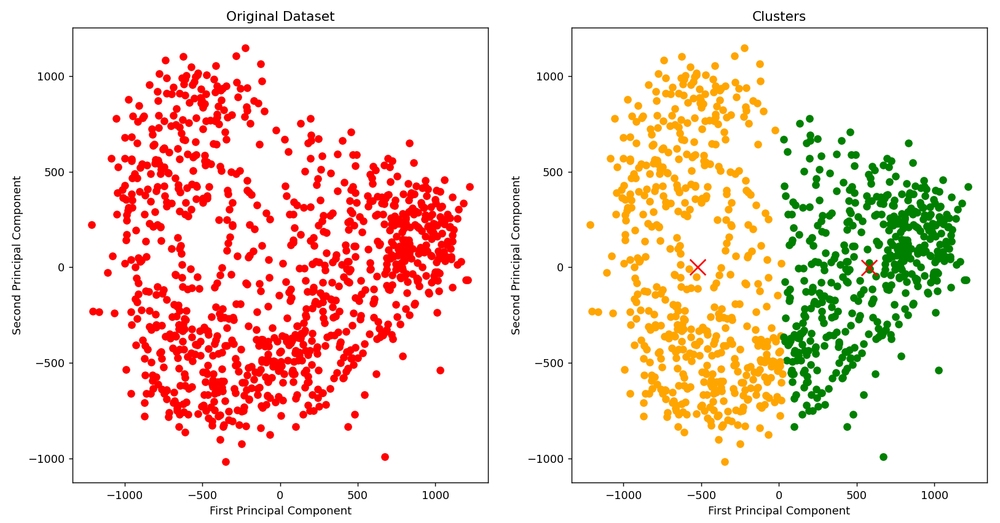

# Entry 4 - Learning Unsupervised
### 3/19/23

My last entry had gone in depth into supervised machine learning, whereas recently I have learned about *unsupervised* machine learning. I continue to learn about machine learning through a [udemy course](https://www.udemy.com/course/hands-on-machine-learning-with-opencv-4/). Simply put, unsupervised learning is when an algorithm learns from unlabelled data, so it has no idea what the dataset contains. It is supposed to analyze the data and "cluster" it into various groups different from each other. The algorithm must discover interesting patterns, which can be done with k-means clustering and hierarchial clustering, altough I focused on **k-means clustering**. 

#### **What is K-Means Clustering?**

**Clustering:** a strategy performed by an unsupervised ML algorithm to classify data. Groups similiar data/observation into clusters/subsets. So, items within a subset are more similiar to each other than items in another subset. 

*K* stands for the number of classes or groups we wish to cluster the dataset into. Data is clustered into k-clusters or classes in a graph *(so basically, two spots on the graph that have large amounts of data, seemingly merging together but having a somewhat visible split)*. To begin, "k" random centroids are chosen for the "k" clusters. Put it simply, K-Random centroids are declared for each category or cluster, and as elements are introduced, the algorithm calculates the distance to these centroids, and puts the element in the category of that centroid. The centroid is then changed, due to the introduction of a new element. This will all become clearer in a graph shown later.

We use this strategy in order to cluster the *Quick, Draw!* dataset from last time. 

#### **The Process**

We will create 2 classes, apples and bananas. We will use the Prinicpal Compononent Analysis (PCA) to reduce the dimensionality from 784 to 2. Apply K-Means to the reduced Dataset.

First we import a few tools and set some constants.

``` python
import numpy as np

# import KMeans from sklearn
from sklearn.cluster import KMeans

# import PCA
from sklearn.decomposition import PCA

# for plotting graphs
import matplotlib.pyplot as plt

# set some constants
N_SAMPLES = 500
TEST_SIZE = 0.2
```

We then load the dataset and conatenate them, just as before.

``` python
apples = apples_full[:N_SAMPLES]
bananas = bananas_full[:N_SAMPLES]

dataset = np.concatenate((apples, bananas))
```

Now, we need to use PCA for dimensionality reduction. But what exactly does PCA do? 
- Our images are flattened and contain 784 pixels.
- We will use these raw pixel values as features for our training classifier. 
- Since 784 features are too diifcult to visualize, we will be reducing it to only 2. We then say the number of components that we want is only 2. 

``` python
pca = PCA(n_components=2)
```

We will them linearly manipulate the dataset in such a way that it only has 2 components. 

``` python
reduced_data = pca.fit_transform(dataset)
```

Now that we only have two components, we can plot the data

``` python
# plot the dataset
plt.subplot(1, 2, 1)
x = reduced_data[:, 0] # extract the x-coordinates
y = reduced_data[:, 1] # extract the y-coordinates
plt.scatter(x, y, c='red') # create a scatter plot

# label the x, y, and title of our scatterplot
plt.xlabel('First Principal Component')
plt.ylabel('Second Principal Component')
plt.title("Original Dataset")
```

We then choose our classifier (K-Means), and we create only two clusters, or two elements. We then perform clustering on the reduced dataset.

``` python
# choose and set the classifier algorithm
clf = KMeans(n_clusters=2)

# perform clustering
clf.fit(reduced_data)
```

We can now evaluate the model and see what it looks like.

``` python
# evaluate model
labels = list(clf.labels_)
print(labels)
```

When this is run, we will see a bunch of 1's and 0's in the terminal. However, in the beginning we have mostly 0's with some 1's in it, and then nearing the end, we have a lot of 1's with some 0's in it. This means our currrent model is very innacurate, becuase the first half of our dataset was all apples, the second half was all bananas. 

Now, we need to get the accuracy of the model.

``` python
# get the total number of ones and zeros
total = len(labels)
ones = labels.count(1)
zeros = total - ones


print("Accuracy:", (total - abs(ones - zeros)) / total)
```

We can get the length of labels array and count only the elements labelled 1. We can then take that and subtract that from the length of the labels array to have the number of zeros. Ideally, the number of elements labelled 1 should be exactly half of the total length of the labels array. So, we test the accuracy by taking the absolute value of (ones minus zeros), and subtracting that from the total, and then dividing that from the total. So, if the model worked perfectly, the `abs(ones - zeros)` should equal to 0, so the total, lets say, 125 elements, minus 0, is still 125. 125 over 125 is 1 which means 100% accuracy. 

When we test the accuracy of our model, it is 95% accurate. 

Now, we have to **visualize** what these clusters look like.

So, we will do some plotting with the `matplotlob` library, and draw a scatterplot of the centroids. If the label is 0, we do orange, else (the label being 1), we use green. 

``` python
# draw the clusters
plt.subplot(1, 2, 2)
for (i, data_point) in enumerate(reduced_data):
    x = data_point[0]
    y = data_point[1]
    if clf.labels_[i] == 0:
        color = 'orange'
    else:
        color = 'green'
    plt.scatter(x, y, c=color)


centroids = clf.cluster_centers_

plt.scatter(centroids[:, 0], centroids[:, 1],
            c="red", s=200, marker='x')

plt.xlabel('First Principal Component')
plt.ylabel('Second Principal Component')
plt.title("Clusters")
plt.show()
```

We then predict a few samples, by giving it samples that it hasn't seen before. 

``` python
# pick out a few samples from the dataset which the classifier has not seen
apple = apples_full[-1] # the last elements of each dataset
banana = bananas_full[-1]

# concatenate them
test_data = np.concatenate(([apple], [banana]))

# perform PCA on them, reducting them 
reduced_test_data = pca.fit_transform(test_data)

# and predict the cluster in which they belong
print("Clusters predicted:")
print(clf.predict(reduced_test_data))
```

This is the outputted graph:



And the output of the classifier prediction is `[0 1]`, which is accurate since apples are labelled as `0` and bananas are `1`. 


### EDP

I feel that I am still transitioning to *Stage 3: Brainstorming Possible Solutions*, because I am still learning a bit more about machine learning before I begin prototyping, but I feel that my project may need to use unsupervised learning to start learning the differences between, for example, a punch and a kick, since these two movements are very different, and in a controlled enviornment, could be fairly easy to detect. 
### Skills

I feel that I have strengthened *How to learn*, because I have been very focused on really understanding machine learning, and writing all sorts of notes to help me understand it has been invaluable. 

I also feel I have gotten better at *How to read*, because I had to do a bit more research to understand much of what there is to understand about unsupervised learning and K-Means algorithms. 

### Conclusion

I feel that as time goes, I learn more and more about my project, but I need to be managing my time a lot better. I want to focus on managing my time for this project better, so that I can get my MVP done in time.

[Previous](entry03.md) | [Next](entry05.md)

[Home](../README.md)